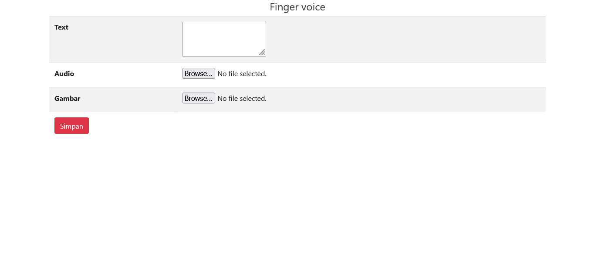

# ISL-WEB-
Indonesian Sign Language mengguanakan sensor flex dan setiap kombinasinya akan mengirimkan data yang akan diproses kedalam bentuk kata suara dimana setiap suara akan dikeluarkan oleh web (Prototype)

